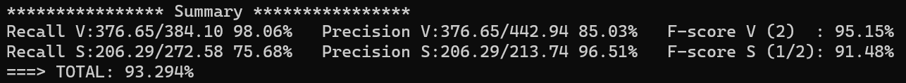

PAV - P2: detección de actividad vocal (VAD)
============================================

Esta práctica se distribuye a través del repositorio GitHub [Práctica 2](https://github.com/albino-pav/P2),
y una parte de su gestión se realizará mediante esta web de trabajo colaborativo.  Al contrario que Git,
GitHub se gestiona completamente desde un entorno gráfico bastante intuitivo. Además, está razonablemente
documentado, tanto internamente, mediante sus [Guías de GitHub](https://guides.github.com/), como
externamente, mediante infinidad de tutoriales, guías y vídeos disponibles gratuitamente en internet.


Inicialización del repositorio de la práctica.
----------------------------------------------

Para cargar los ficheros en su ordenador personal debe seguir los pasos siguientes:

*	Abra una cuenta GitHub para gestionar esta y el resto de prácticas del curso.
*	Cree un repositorio GitHub con el contenido inicial de la práctica (sólo debe hacerlo uno de los
	integrantes del grupo de laboratorio, cuya página GitHub actuará de repositorio central del grupo):
	-	Acceda la página de la [Práctica 2](https://github.com/albino-pav/P2).
	-	En la parte superior derecha encontrará el botón **`Fork`**. Apriételo y, después de unos segundos,
		se creará en su cuenta GitHub un proyecto con el mismo nombre (**P2**). Si ya tuviera uno con ese 
		nombre, se utilizará el nombre **P2-1**, y así sucesivamente.
*	Habilite al resto de miembros del grupo como *colaboradores* del proyecto; de este modo, podrán
	subir sus modificaciones al repositorio central:
	-	En la página principal del repositorio, en la pestaña **:gear:`Settings`**, escoja la opción 
		**Collaborators** y añada a su compañero de prácticas.
	-	Éste recibirá un email solicitándole confirmación. Una vez confirmado, tanto él como el
		propietario podrán gestionar el repositorio, por ejemplo: crear ramas en él o subir las
		modificaciones de su directorio local de trabajo al repositorio GitHub.
*	En la página principal del repositorio, localice el botón **Branch: master** y úselo para crear
	una rama nueva con los primeros apellidos de los integrantes del equipo de prácticas separados por
	guion (**fulano-mengano**).
*	Todos los miembros del grupo deben realizar su copia local en su ordenador personal.
	-	Copie la dirección de su copia del repositorio apretando en el botón **Clone or download**.
		Asegúrese de usar *Clone with HTTPS*.
	-	Abra una sesión de Bash en su ordenador personal y vaya al directorio **PAV**. Desde ahí, ejecute:

		```.sh
		git clone dirección-del-fork-de-la-práctica
		```

	-	Vaya al directorio de la práctica `cd P2`.
	-	Añada la etiqueta `origin` a su copia del repositorio. Esto es útil para facilitar los *push* y
		*pull* al repositorio original:
		```.sh
		git remote add origin dirección-del-fork-de-la-práctica
		```
	-	Cambie a la rama **fulano-mengano** con la orden:

		```.sh
		git checkout fulano-mengano
		```

*	A partir de este momento, todos los miembros del grupo de prácticas pueden trabajar en su directorio
	local del modo habitual.
	-	También puede utilizar el repositorio remoto como repositorio central para el trabajo colaborativo
		de los distintos miembros del grupo de prácticas; o puede serle útil usarlo como copia de
		seguridad.
	-	Cada vez que quiera subir sus cambios locales al repositorio GitHub deberá confirmar los
		cambios en su directorio local:

		```.sh
		git add .
		git commit -m "Mensaje del commit"
		```

		y, a continuación, subirlos con la orden:

		```.sh
		git push -u origin fulano-mengano
		```

*	Al final de la práctica, la rama **fulano-mengano** del repositorio GitHub servirá para remitir la
	práctica para su evaluación utilizando el mecanismo *pull request*.
	-	Vaya a la página principal de la copia del repositorio y asegúrese de estar en la rama
		**fulano-mengano**.
	-	Pulse en el botón **New pull request**, y siga las instrucciones de GitHub.


Entrega de la práctica.
-----------------------

Responda, en este mismo documento (README.md), los ejercicios indicados a continuación. Este documento es
un fichero de texto escrito con un formato denominado _**markdown**_. La principal característica de este
formato es que, manteniendo la legibilidad cuando se visualiza con herramientas en modo texto (`more`,
`less`, editores varios, ...), permite amplias posibilidades de visualización con formato en una amplia
gama de aplicaciones; muy notablemente, **GitHub**, **Doxygen** y **Facebook** (ciertamente, :eyes:).

En GitHub. cuando existe un fichero denominado README.md en el directorio raíz de un repositorio, se
interpreta y muestra al entrar en el repositorio.

Debe redactar las respuestas a los ejercicios usando Markdown. Puede encontrar información acerca de su
sintáxis en la página web [Sintaxis de Markdown](https://daringfireball.net/projects/markdown/syntax).
También puede consultar el documento adjunto [MARKDOWN.md](MARKDOWN.md), en el que se enumeran los
elementos más relevantes para completar la redacción de esta práctica.

Recuerde realizar el *pull request* una vez completada la práctica.

Ejercicios
----------

### Etiquetado manual de los segmentos de voz y silencio

- Etiquete manualmente los segmentos de voz y silencio del fichero grabado al efecto. Inserte, a 
  continuación, una captura de `wavesurfer` en la que se vea con claridad la señal temporal, el contorno de
  potencia y la tasa de cruces por cero, junto con el etiquetado manual de los segmentos.

- A la vista de la gráfica, indique qué valores considera adecuados para las magnitudes siguientes:

	* Incremento del nivel potencia en dB, respecto al nivel correspondiente al silencio inicial, para
	  estar seguros de que un segmento de señal se corresponde con voz.

	* Duración mínima razonable de los segmentos de voz y silencio.

	* ¿Es capaz de sacar alguna conclusión a partir de la evolución de la tasa de cruces por cero?


### Desarrollo del detector de actividad vocal

- Complete el código de los ficheros de la práctica para implementar un detector de actividad vocal tan
  exacto como sea posible. Tome como objetivo la maximización de la puntuación-F `TOTAL`.

Con el objetivo de implementar un detector lo más plural y versátil posible, hemos decidido maximizar la puntuación-F total sobre la base de datos en vez de hacerlo sobre nuestra señal. En consecuencia, el resultado va a diferir bastante, como veremos a continuación.

Los parámetros principales de la trama que son decisivos en la puntuación son:
* Su potencia en dB
* Su amplitud media
* Su zero crossing rate
* Su duración en milisegundos

Para maximizarla, tenemos que ir probando distintas combinaciones de estos valores e implementarlas en el programa vad.c de manera correcta.

Para empezar, creamos las variables dentro de los códigos source y las asociamos a un parámetro de entrada del comando de ejecución de vad, como se nos indica en el anexo I. De esta manera, ofrecemos las siguientes opciones:


Dónde las opciones ‘-0’, ‘-1’, ‘-2’, ‘-3’, son las que hemos añadido. En los códigos figuran como:


Y las variables k0, k1, k2, k3, son las que usaremos para definir thresholds a partir de sus parámetros de entrada análogos.
Lo siguiente es implementar estos valores en la máquina de estados finitos. Esto lo hemos hecho de la siguiente manera:


Vemos que alfa0, alfa1 y alfa2 son offsets que se añaden a la potencia, amplitud media y zcr de la trama, mientras que ftime es un offset que se le añade a la constante FRAME_TIME, definida por defecto como 10 milisegundos. Ahora las longitudes de las tramas tendrán en cuenta la opción elegida por el usuario, y el estado sólo cambiará si se superan los tres thresholds, también modificados desde el terminal.

A continuación, necesitamos automatizar el trabajo. Actualizamos el script run_vad.sh para que pruebe diferentes combinaciones para los parámetros:


Ahora, el script ejecuta tanto vad como el evaluador para diferentes combinaciones de 3 valores (en el primer caso, las tres alfas), y añade el valor de los parámetros y el total de puntuación al fichero “results.txt” para cada uno de los casos. Para un set de valores, quedaría así:


Para el siguiente, se añadiría una línea en blanco y se escribiría en el mismo formato, y así para cada combinación.

A continuación, como el fichero resulta muy largo, escribimos un script en Matlab para encontrar los parámetros óptimos y la eficiencia que suponen.


Ejecutando ambos scripts con diferentes valores y configuraciones, vamos ajustándonos poco a poco al máximo. Apuntamos los valores máximos para cada caso:


Cada columna representa una alfa de la 0 a la 2, y si hay un guión significa que no se ha tenido en cuenta el parámetro (no se ha añadido la condición a la máquina de estados). Cada línea contiene los valores óptimos de la prueba junto con su total correspondiente.

De las 5 primeras líneas sacamos que el zcr es un parámetro malo para estimar los tramos de nuestra database. Esto puede ser debido a que, mientras que la intensidad de la voz y el ruido de cada fichero de audio es muy similar, las frecuencias de la voz son muy diferentes, por tanto, al haber mayor varianza hay una peor estimación.

Decidimos seguir probando con los offsets en la potencia y la amplitud de las tramas, hasta que llega a su máximo (penúltima línea), y por más que ampliemos los valores de búsqueda, el resultado no mejora. En este instante, decidimos modificar el tiempo de cada trama, y para nuestra sorpresa, el resultado mejora en el primer intento. A continuación, decidimos suprimir el parámetro relacionado con el zcr y sustituirlo por el offset añadido a los 10 ms originales de tiempo de la trama. Obtenemos los siguientes resultados:


Vamos acotando y aumentando la precisión poco a poco para obtener el mejor resultado contemplando decimales, hasta que encontramos el último set de parámetros:

* Offset en de potencia = 8.60 dB
* Offset en amplitud media = 0.0003950
* Offset en tiempo de trama = 84 ms

Con lo que obtenemos un resultado de 93.294%. Aún no satisfechos, intentamos añadir el zcr como cuarta variable, pensando que la decisión de sonoridad en función de su valor quizás mejoraría con un tiempo de trama diferente, pero el resultado se sigue alejando mucho del máximo. También por infortunio, usando el vad para nuestra señal de voz con estos mismos parámetros, obtenemos un desastroso 59.125%.

Para finalizar, añadimos estos valores como opciones default del programa vad, de manera que se obtengan los mejores resultados ejecutando el programa sin especificar los parámetros. La máquina de estados finitos sólo considera que, para cambiar de estado, tienen que superar un threshold la potencia y la amplitud media; eliminamos la condición de zcr pero dejamos un valor default de -350.

Analizando este sistema de optimización, habría sido muy interesante hacer una ejecución con los 4 parámetros y un gran abanico de posibles valores, pero el coste computacional habría sido demasiado alto.


- Inserte una gráfica en la que se vea con claridad la señal temporal, el etiquetado manual y la detección
  automática conseguida para el fichero grabado al efecto. 

Nuestra señal con los etiquetados queda como:


- Explique, si existen. las discrepancias entre el etiquetado manual y la detección automática.

Los desajustes más pequeños se producen en los cambios de sonoridad, en los tramos toman una gran cantidad de valores. No obstante, el desajuste más importante es en la dicción del segundo nombre, que tiene una potencia notablemente menor que el resto.


- Evalúe los resultados sobre la base de datos `db.v4` con el script `vad_evaluation.pl` e inserte a 
  continuación las tasas de sensibilidad (*recall*) y precisión para el conjunto de la base de datos (sólo
  el resumen).



Como era de esperar, al optimizar los parámetros sobre la base de datos los resultados globales son mucho mejores que los de nuestro caso, que tiene un segmento sonoro con amplitud anómalamente baja.


### Trabajos de ampliación

#### Cancelación del ruido en los segmentos de silencio

- Si ha desarrollado el algoritmo para la cancelación de los segmentos de silencio, inserte una gráfica en
  la que se vea con claridad la señal antes y después de la cancelación (puede que `wavesurfer` no sea la
  mejor opción para esto, ya que no es capaz de visualizar varias señales al mismo tiempo).

#### Gestión de las opciones del programa usando `docopt_c`

- Si ha usado `docopt_c` para realizar la gestión de las opciones y argumentos del programa `vad`, inserte
  una captura de pantalla en la que se vea el mensaje de ayuda del programa.


Observaciones:
* Los valores default son los óptimos, de manera que, al ejecutar vad sin opciones sobre la database, se obtendran los mejores resultados
* Como se ha comentado en el ejercicio básico 2, se puede modificar el parámetro correspondiente al zcr, aunque se haya decidido prescindir de él para la detección.


### Contribuciones adicionales y/o comentarios acerca de la práctica

- Indique a continuación si ha realizado algún tipo de aportación suplementaria (algoritmos de detección o 
  parámetros alternativos, etc.).

Automatización del trabajo: modificación del archivo 'run_vad.sh' en 'scripts' (código comentado).
Algoritmos de detección: fichero 'getBestParameters' en la carpeta 'scripts', Matlab.

Parámetros alternativos: tiempo de trama.

- Si lo desea, puede realizar también algún comentario acerca de la realización de la práctica que
  considere de interés de cara a su evaluación.


### Antes de entregar la práctica

Recuerde comprobar que el repositorio cuenta con los códigos correctos y en condiciones de ser 
correctamente compilados con la orden `meson bin; ninja -C bin`. El programa generado (`bin/vad`) será
el usado, sin más opciones, para realizar la evaluación *ciega* del sistema.
